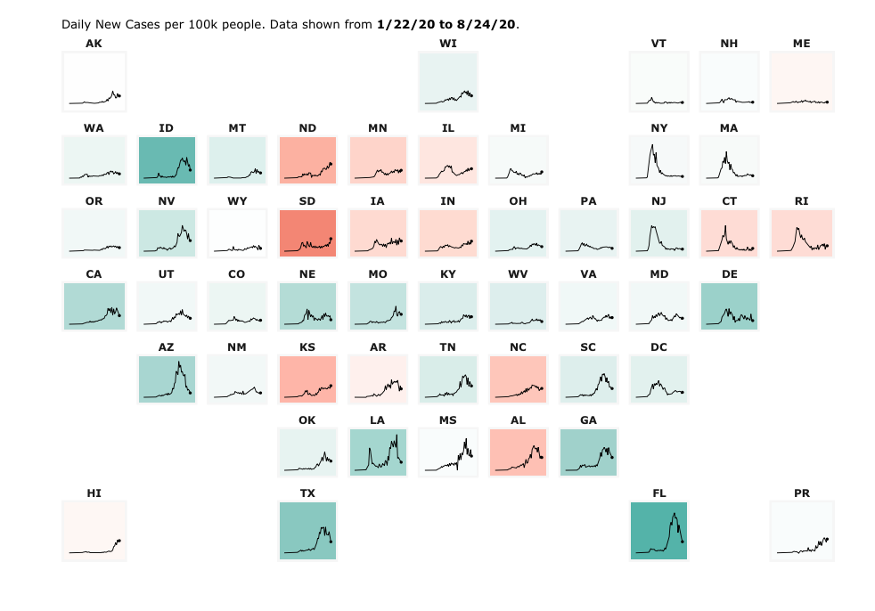

```{r setup, include=FALSE}
require(tidyverse)
library(learnr)
library(submitr)
library(etude)
library(gradethis)
library(ggformula)
library(gganimate)
knitr::opts_chunk$set(echo = FALSE,
                      fig.width = 4.5, fig.height = 3.5)
learnr::tutorial_options(
  exercise.timelimit = 200, 
  exercise.checker = #gradethis::grade_learnr) 
  submitr::null_code_checker)

theme_set(theme_void(base_size = 20))

crime <- read_csv('https://sldr.netlify.app/data/sscrime.csv')
```

<!-- ```{r} -->
<!-- submitr::login_controls() -->
<!-- ``` -->

<!-- ```{r context = "server", echo = FALSE} -->
<!-- # bookmarking of progress is disabled, and also previous login credentials not autofilled -->
<!-- options(tutorial.storage = "none") -->
<!-- vfun <- make_basic_validator('www/citizens.csv', "rainbow-mask") #basket::check_valid -->
<!-- storage_actions <- record_local("./www/chart-chooser-submissions.csv") -->
<!-- submitr::shiny_logic(input, output, session, vfun, -->
<!--                      storage_actions) -->
<!-- ``` -->

<!-- <!--End of submitr setup--> -->


## Motivation: Imagine First!
Figures are a crucial tool for exploring your data *and* communicating what you learn from the data.

Whether you are doing a quick check to assess basic features of a dataset or creating a key figure for an important presentation, the best practice is to work thoughtfully. You already learned about creating graphics by I.C.E.E:

### The **I.C.E.E. method**: 

- **I***magine* how you want your graph to look, *before* you 
- **C***ode*. Once you have the basic starting point, 
- **E***valuate* your work, and
- **E***laborate* (refine it).

Repeat until the figure is as awesome as it needs to be.

### Limiting Your Imagination
There is really no limit to the creative data visualizations you might dream up.

But there is a set of basic, workhorse graphics that statisticians and data scientists use most frequently. What are the common options and how do you choose among them?

The best choice depends on what kind of data you have, and also on what you want to do with it: what question are your trying to answer? What story will you tell?

## Learning Objectives

This tutorial will give you tools to:

1. **Choose an appropriate visualization** for the *data you have* and the *question you are trying to answer*.
2. **Graph data with integrity**, avoiding misleading design choices
3. **Tell the right story**, including elements that *emphasize your main finding* and make your figure *easy to interpret at a glance*

Specifically, you will now focus on **choosing the right type of visualization for the task at hand.**

Note that the graphs shown in this tutorial are over-simplified versions - icons, really - with missing labels, huge titles, and huge data elements. This is intentional, to evoke the look of each plot type rather than to present actual data.

## Variable Types
Before designing a graphic, you need some data. Ideally, it will be in a tidy table, with one row per case and one column per variable.

Different plots may be appropriate, depending on whether the variable is:

- *Categorical* (either nominal or ordinal) or 
- *Quantitative* (interval or ratio)
- *Note:* Variables that take on discrete numeric values can be treated as either, depending mainly on whether there are a lot of possible values (treat like numeric) or few (treat like categorical)

For a review of variable types, check out the 3-minute, optional video before you continue.


## Distributions
Sometimes, you need a plot that lets you *see* the *distribution* of a single variable: 

- What *values* does it take on?
- How *often* does each value occur?

Sometimes these graphs present the answer to a scientific question of interest, but often they are used during exploration or model assessment to better understand a dataset and:

- Check the data 
  - Are there lots of missing values? 
  - Are missing values encoded as 999 or -1000 or some other impossible value instead of being marked as "NA"?
- Verify whether the variable's distribution matches expectations (for example, approximate normality or unimodality)

## Gallery: One Categorical Variable
To show one categorical variable, you might use bar, lollipop/Cleveland dot plots, or pie graphs.

```{r}
one_cat <- tibble(Graph = c('Bar', 
                            'Lollipop',
                            'Cleveland Dot',
                            #'waffle',
                            'Pie'),
                  `Show Proportions?` = sapply(c('white_check_mark', 
                                               #'white_check_mark', 
                                               'white_check_mark', 
                                               'white_check_mark', 
                                               'white_check_mark'), 
                                             emo::ji),
                  `Show Counts?` = sapply(c('white_check_mark',
                                            'white_check_mark',
                                            'white_check_mark', 
                                         # 'x', 
                                          'x'),
                                        emo::ji),
                  Statisticians = sapply(c('heart_eyes', 
                                            #'sunglasses', 
                                            'sunglasses',
                                           'sunglasses',
                                           'rage'),
                                         emo::ji)
                  )
pander::pander(one_cat)
```

### . 

```{r, echo = FALSE}
gf_bar(~Location, data = crime) %>%
  gf_labs(title = 'BAR')
```

- Can show either counts, proportions, or percentages
- Easy to see which categories have more/fewer observations

<!-- ### Waffle Charts -->

<!-- ```{r, echo = FALSE} -->
<!-- my_waffle <- function(factor, nrow, ncol){ -->

<!-- } -->
<!-- ``` -->

<!-- - Show a set number of icons, *not* necessarily the same as number of observations -->
<!-- - More playful, less serious -->
<!-- - Well-chosen icons can tell a memorable story -->

### .

```{r, cleveland, echo = FALSE, message = FALSE}
loc <- crime %>%
  group_by(Location) %>%
  summarize(n = n(), freq = n / nrow(crime)) %>%
  mutate(Location = forcats::fct_reorder(factor(Location), n))

gf_point(Location ~ n, data = loc,
         size = 10) %>%
  gf_lims(x = c(0, 1.1*max(loc$n))) %>%
  gf_labs(title = 'CLEVELAND DOT') %>%
  gf_theme(panel.grid.major.y = element_line(color = 'grey70'),
           panel.grid.major.x = element_blank(),
           panel.grid.minor.x = element_blank(),
          axis.line = element_line(color = 'black', size = 3))
```

```{r, lollipop, echo = FALSE, message = FALSE}
gf_point(Location ~ n, data = loc,
         size = 10) %>%
  gf_segment(Location + Location ~ 0 + n,
             color = 'black', size = 2) %>%
  gf_labs(title = 'LOLLIPOP') %>%
  gf_theme(panel.grid.major.y = element_line(color = 'grey70'),
           panel.grid.major.x = element_blank(),
           panel.grid.minor.x = element_blank(),
            axis.line = element_line(color = 'black', size = 3))

```

- Main difference is whether the "sticks" are drawn (Lollipop) or not (Cleveland Dot)
- Much like a bar chart, but using dots or lollipops to mark the count or proportion in each category
- Work well when there are many categories to be ranked by frequency

### .


```{r, echo = FALSE, message = FALSE}
gf_bar(~1, fill = ~Location, data = crime, width = 1) %>%
  gf_refine(coord_polar('y')) %>%
  gf_theme(legend.position = 'none') %>%
  gf_labs(title = 'PIE') %>%
  gf_refine(scale_fill_brewer(palette = 'Greys'))
```


- Display proportions, not counts
- Unpopular with many statisticians and data scientists because...
  - Hard to see which categories have more/fewer observation when proportions similar
  - Temptation to clutter them up with annotation (for example, percentage for each slice)
  - Can be inefficient use of space on rectangular page
- Often easier to interpret when there are few categories

## Gallery: One Quantitative Variable

### .


```{r, message = FALSE, warning = FALSE}
set.seed(124)
gf_dotplot(~TrainingHours, data = mosaic::sample(crime, size = 25, replace = TRUE), 
           method = 'histodot', binwidth = 0.25) %>%
  gf_labs(title = 'DOTPLOT') %>%
  gf_theme(#panel.grid.major.y = element_line(color = 'grey70'),
           #panel.grid.major.x = element_blank(),
          # panel.grid.minor.x = element_blank(),
            axis.line.x = element_line(color = 'black', size = 3))
```

- Intuitive representation: x-axis shows range of variable values, and dots are data points
- As the idea is to show one dot per observation, may not work well for huge datasets

### .

```{r}
set.seed(124)
gf_histogram(~TrainingHours, 
             data = mosaic::sample(crime, size = 25, replace = TRUE),
             binwidth = 0.7) %>%
  gf_labs(title = 'HISTOGRAM') %>%
  gf_theme(#panel.grid.major.y = element_line(color = 'grey70'),
           #panel.grid.major.x = element_blank(),
          # panel.grid.minor.x = element_blank(),
            axis.line.x = element_line(color = 'black', size = 3))
```

- Range of variable values is divided into bins, then height of each bar corresponds to the number of observations in the bin
- Effective way to examine the *shape* of a distribution
- Choosing the number of bins to use is tricky: too many, and the shape is jagged; too few over-smooths (peaks blend together). Not sure? Find a number of bins that is definitely too few, and one that is definitely too many, and then try to settle on an in-between value that best shows the real shape of the distribution without over-smoothing.

### .

```{r}
set.seed(124)
gf_density(~TrainingHours, 
           data = mosaic::sample(crime, size = 25, replace = TRUE)) %>%
  gf_labs(title = 'DENSITY') %>%
  gf_theme(#panel.grid.major.y = element_line(color = 'grey70'),
           #panel.grid.major.x = element_blank(),
          # panel.grid.minor.x = element_blank(),
            axis.line.x = element_line(color = 'black', size = 3))
```


- Like a smoothed version of a histogram (obtained by kernel density estimation, if you want to look up mathematical details)
- Caution: for small datasets, the density plot may show "peaks" that really correspond to one or a few observations
- Can only show *density* (relative frequency of observation), *not counts*

### .

```{r}
gf_qq(~TrainingHours, data = crime,
      size = 3) %>%
  gf_qqline(color = 'grey50', linetype = 'solid', size = 2) %>%
  gf_labs(title = 'Q-Q', x = 'Theoretical', y = 'Data') %>%
  gf_theme(axis.line = element_line(color = 'black', size = 3),
           axis.title.x = element_text(),
           axis.title.y = element_text(angle = 90))
```

- "Q-Q Plot" is short for "Quantile-Quantile Plot"
- In some cases, we want to examine the shape of a variable's distribution *to see if it matches a theoretical expectation*. For example: do the regression residuals match a normal distribution? (If that example doesn't make sense to you now - it will later in the course, don't worry.)
- Quantile-quantile plots are one way to make this comparison. They plot the quantiles of the data as a function of the same quantiles of the expected theoretical distribution; if there's a good match, the points should follow a line with slope = 1.
- How close to the straight line is "close enough"? That's the tricky part...

### Check Your Understanding: One-variable plots


```{r no-histo}
learnr::question("Which plot would work best to show the distribution of 75 families' household incomes?",
                 answer('Histogram', correct = TRUE),
                 answer('Lollipop plot', message = 'These work better for counts or proportions (or some other summary metric) in categories. By default, there would be one lollipop for each unique value of income - what a mess!'),
                 answer('Bar chart', message = 'These work better for counts or proportions (or some other summary metric) in categories. By default, there would be one bar for each unique value of income - probably a mess!'),
                 allow_retry = TRUE,
                 random_answer_order = TRUE)
```

## Relationships 
Very often, we want to examine *relationships* between variables, not individual variables' distributions. This means thinking carefully about what types of variables are in the (potential) relationship, and how we can best show their values graphically.

## Gallery: 2-3 Cat.


```{r}
gf_bar(~Location, fill = ~DressCode,
       position = 'dodge',
       data = crime) %>%
  gf_labs(title = 'SIDE-BY-SIDE BAR') %>%
  gf_theme(legend.position = 'none') %>%
  gf_theme(scale_fill_brewer(palette = 'Greys'))
```


- One set of bars per "category", colored by "groups" -- shows *two* categorical variables at once
- Good for showing *counts* in each combination of categories/groups
- It is hard to compare proportion in each group across categories, if the total number in each category differs.

### .

```{r, stacked-bar}
gf_bar(~Location, fill = ~DressCode,
       position = 'stack',
       data = crime) %>%
  gf_labs(title = 'STACKED BAR') %>%
  gf_theme(legend.position = 'none') %>%
  gf_theme(scale_fill_brewer(palette = 'Greys'))
```


- Similar to side-by-side bar
- Compared to side-by-side, it's *harder* to compare proportions in each group within a category, but *easier* to estimate the proportion in each category.

### .

```{r, facet-bar}
gf_props(~Location | DressCode,
       data = crime,
       denom = ~PANEL) %>%
  gf_labs(title = 'FACETED BAR') %>%
  gf_theme(legend.position = 'none',
           strip.text.x = element_blank(),
           panel.border = element_rect(fill = NA, size = 2)) %>%
  gf_theme(scale_fill_brewer(palette = 'Greys'))
```


- One plot box -- usually called a "panel" or "facet" -- for each of a set of groups
- Think carefully about the question of interest and the relationship you want to highlight as you choose: should bar heights correspond to... 
  - Number of observations?
  - Proportion of observations *overall in the whole dataset*?
  - Proportion of observations *in the panel*?
  - Something else?
  
### Combinations (Stacked bars + Facets, etc.)
Of course, if you have 3 variables instead of just two, you *can* combine methods. Avoid it unless you are sure it is necessary and communicates clearly.

- **Be sure that the resulting graph is not too complex to understand quickly, at a glance.** Packing too much information into one graph sometimes means *none* of the info is actually communicated!
- And if showing proportions or percentages in such a display, **be sure you understand what denominator is being used in the calculations** -- is it the fraction of the whole dataset, within facets, etc.?

```{r, stacked-and-facetted-bar, fig.width = 9 }
gf_props(~Location | DressCode,
         fill = ~StudentIDBadges,
       data = crime,
       denom = ~PANEL) %>%
  gf_labs(title = 'STACKED BAR + FACETS') %>%
  gf_theme(legend.position = 'none',
           strip.text.x = element_blank(),
           panel.border = element_rect(fill = NA, size = 2)) %>%
  gf_theme(scale_fill_brewer(palette = 'Greys'))
```


```{r, side-by-side-and-facetted-bar, fig.width = 9 }
gf_props(~Location | DressCode,
         fill = ~StudentIDBadges,
         position = 'dodge',
       data = crime,
       denom = ~PANEL) %>%
  gf_labs(title = 'SIDE-BY-SIDE + FACETS') %>%
  gf_theme(legend.position = 'none',
           strip.text.x = element_blank(),
           panel.border = element_rect(fill = NA, size = 2)) %>%
  gf_theme(scale_fill_brewer(palette = 'Greys'))
```


## Gallery: 2-3 Quant.


```{r, scatter}
gf_point(ViolentIncidentsTotal ~ NEnrollment, 
         data = mosaic::sample(crime, size = 100, replace = TRUE),
         size = 3) %>%
  gf_labs(title = 'SCATTER', x = '', y = '') %>%
  gf_theme(axis.line = element_line(color = 'black', size = 3))
```


- A scatterplot is the default for visualizing the relationship between two quantitative variables
- Be sure you actually have *two quantitative variables*! If not, another plot may be a better option

### .


```{r, scatter-line}
d <- data.frame(t = 1:60)
d <- d %>% mutate(y = 50 + 0.75*t + rnorm(60, 0, 5))

gf_line(y ~ t, 
         data = d,
         size = 3) %>%
  gf_labs(title = 'LINE', x = '', y = '') %>%
  gf_theme(axis.line = element_line(color = 'black', size = 3))
```


- If the x-axis variable is **Time** (or it otherwise makes sense to join the dots), a line can replace the dots, or be added to them
- Make sure connecting the dots makes sense in context and does not guide the eye to incorrect interpretations (for example, emphasizing outliers)


### Adding More Quant. Variables

What if you have three or four quantitative variables whose relationships you're curious about?

*Proceed with caution!*  

It's possible to include 3+ variables on one plot, but ideally **it should still be interpretable at a glance:**

- What is the main point of the figure? Is it possible to make the point without showing all 3+ variables together?
- Keep things as simple as you can while still telling the story you want to tell.

### .

```{r, scatter-with-size}
set.seed(44)
gf_point(log(AttacksWithoutWeapon) ~ log(Vandalism), size = ~NEnrollment, 
         data = mosaic::sample(crime, size = 100, replace = TRUE)) %>%
  gf_labs(title = 'SCATTER + SIZE', x = '', y = '') %>%
  gf_theme(legend.position = 'none',
           axis.line = element_line(color = 'black', size = 3))
```


- You can adjust the size of each dot in a scatter plot to correspond to the value of a third variable
- This is especially useful when the third variable measures the size of the population being represented -- for example, a scatter plot of life expectancy vs income for many countries, with point size indicating population of each country

## Gallery: Mixed Quant. + Cat.
There are several plots designed specifically to look at the distribution of a quantitative variable, grouped by a categorical variable.

### .

```{r, boxplot}
gf_boxplot(NEnrollment ~ Location, data = crime) %>%
  gf_labs(title = "BOXPLOTS")
```

```{r, boxplot-horiz}
gf_boxplot(NEnrollment ~ Location, data = crime) %>%
  gf_refine(coord_flip()) %>%
  gf_labs(title = "BOXPLOTS (HORIZONTAL)")
```

- The boxplot shows a *summary* of the distribution. The box spans the middle half of the data, with the line marking the median. The "whisker" lines extend to cover the range of "most of" the data, with outliers shown individually
- For details, check out [this great explanation of how boxplots are constructed](https://openintro.shinyapps.io/ims-02-summarizing-and-visualizing-data-02/#section-box-plots) from [Introduction to Modern Statistics](https://openintro-ims.netlify.app/index.html) by Mine Çetinkaya-Rundel and Johanna Hardin.
- If your dataset is too small to estimate the median and quartiles of the data accurately, consider showing all the observations (for example, using or overlaying a jitter plot) 

### .

```{r, violin}
gf_violin(TrainingHours ~ Enrollment, data = crime) %>%
  gf_labs(title = "VIOLIN PLOTS")
```

```{r, violin-horiz}
gf_violin(TrainingHours ~ Enrollment, data = crime) %>%
  gf_refine(coord_flip()) %>%
  gf_labs(title = "VIOLIN (HORIZONTAL)")
```

- These show a mirrored density plot for each group
- As for density plots, make sure you have a large enough dataset so that the bumps in the density curve don't represent just one or a couple of observations

### Facets?
You can also consider making multi-panel plots with one histogram, density plot, or dotplot per facet, but comparing between facets is usually harder than comparing boxplots or violin plots on a single axis.

### Check Your Understanding: Quant. + Cat.

**There are some errors and inconsistencies in the chart below!**

{width=600px}

*[Infographic from activewizards.com](https://activewizards.com/content/blog/How_to_Choose_the_Right_Chart_Type_[Infographic]/chart-types-infographics04.png)*

```{r oops-boxplot}
learnr::question('What is strange about the placement of boxplots in the activewizards flow chart?',
                 answer('They are in the "You only have one variable" section', correct = TRUE,
                        message = 'Boxplots usually work best to compare distributions between groups. The image even shows boxplots for several groups. But that implies that the data have at least two variables...<br>'),
                 answer('The boxes have two colors', correct = TRUE,
                        message = 'The box in a boxplot shows data from one variable, so it would be confusing (not to mention hard to do in statistical software) to make a single boxplot box one color on top and the other on the bottom.<br>'),
                 answer('The boxes are different sizes',
                        message = 'Boxplot box size depends on the range and distribution of the observed data points, so it is normal for box size to vary.<br>'),
                 allow_retry = TRUE,
                 incorrect = 'Try again. There may be multiple correct answers.',
                 random_answer_order = TRUE
)
```


## Gallery: 3+ Quant. + Cat.

What if you want to show how three or more variables interact, with a mix of quantitative and categorical data? Surprisingly, this can often be done well. Color and Facets to the rescue!

### .

```{r, scatter-with-color}
set.seed(44)
d <- data.frame(x = runif(100, 0, 100))
d <- d %>%
  mutate(y = c(55 + 0.75*d$x[1:50] + rnorm(50, 0, 10),
                      30 + 0.15*d$x[51:100] + rnorm(50, 0, 10)),
                z = c(rep('g1', 50), rep('g2', 50))
                )
gf_point(y ~ x, color = ~z, 
         data = d,
         size = 4) %>%
  gf_lm() %>%
  gf_labs(title = 'SCATTER + COLOR', x = '', y = '') %>%
  gf_theme(scale_color_brewer('', palette = 'Greys', guide = FALSE)) %>%
  gf_theme(axis.line = element_line(color = 'black', size = 3))
```


- Coloring the points in a scatter plot by a categorical variable is especially useful if the trend varies by category
- Adding trend lines for each category can guide the eye, which may be helpful (if a real linear trend exists)
- Shape can be used as well as color 
  - To reinforce groups (redundant coding - useful for color-blind viewers and in case the figure is copied in black-and-white) 
  - To represent yet another variable (be careful that the result is still interpretable at a glance)
- You can also color by quantitative variables, but it's less often useful

### .

```{r, scatter-facets}
set.seed(42)
d <- data.frame(x = runif(1000, 0, 100),
                g = gl(4, 250))
d <- d %>%
  group_by(g) %>%
  mutate( y = runif(1, 0, 100) + 
            sample(seq(from = 0, by = 0.2, to = 1), 
                                        size = 1, 
                                        replace = FALSE) * x + 
            rnorm(n(), 0, 10))
gf_point(y ~ x | g,
         color = 'grey44',
         data = d) %>%
  gf_lm(color = 'black') %>%
  gf_labs(title = 'SCATTER + FACETS', x = '', y = '') %>%
  gf_theme(strip.text.x = element_blank(),
           panel.border = element_rect(fill = NA, size = 2))
```


- If you have many groups, it may be clearer to have one facet for each group
- Standard practice is to **keep axis limits the same for all facets**. 
- If you break this "fixed scales" rule of thumb, be sure you have a compelling reason, because the viewer will often assume scales are the same: making them different can lead to misinterpretation

### .

```{r, small-mult}
set.seed(44)
d <- data.frame(x = runif(2000, 0, 100),
                g = gl(40, 50))
d <- d %>%
  group_by(g) %>%
  mutate( y = runif(1, 0, 100) + 
            sample(seq(from = 0, by = 0.2, to = 1), 
                                        size = 1, 
                                        replace = FALSE) * x + 
            rnorm(n(), 0, 10))
gf_point(y ~ x | g,
         color = 'grey44',
         data = d) %>%
  gf_lm(color = 'black') %>%
  gf_labs(title = 'SMALL MULTIPLES', x = '', y = '') %>%
  gf_theme(strip.text.x = element_blank(),
           panel.border = element_rect(fill = NA, size = 2))
```


- Taking this to an extreme, you can use a "small multiples" plot with *many* facets. In this case the scales should definitely be fixed, since their labels will be left out or too small to read.
- Small multiples can work well to compare trends over time (one facet per time period) or across many groups

## Animation
For presentation and web graphics (but not printed material), animation can be used to show how a trend changes over time (or as some other third variable changes).

Ensure the animation emphasizes the story you want to tell, rather than providing a flashy distraction from it.


```{r, animated-scatter, message = FALSE}
if (!file.exists('images/animated-scatter.gif')){
set.seed(44)
d <- data.frame(x = runif(2000, 0, 100),
                g = gl(40, 50))
d <- d %>%
  group_by(g) %>%
  mutate( y = 50 + 
            as.numeric(g)  * x + 
            rnorm(n(), 0, 300)) %>%
  ungroup()

gf_point(y ~ x,
         data = d) %>%
  gf_labs(title = 'ANIMATION', x = '', y = '') %>%
  gf_theme(axis.line = element_line(color = 'black', size = 3)) %>%
  gf_refine(gganimate::transition_states(g))

anim_save('images/animated-scatter.gif')
}

knitr::include_graphics('images/animated-scatter.gif')
```


### Check Your Understanding: Multi-variable plots

````{r cats-dogs}
learnr::question("If you wanted to show how weight depends on length for cats versus dogs, which type of graph might work well?",
                 answer("Scatter plot with color", correct = TRUE, 
                        message = 'Yes. You could plot weight as a function of length, coloring the points by species (cat or dog).'),
                 answer("Bubble chart (scatter plot plus size)", 
                        message = 'A bubble chart would not be ideal. It would not make sense to use size of points to indicate dogs vs. cats, so point size would have to represent length or weight. But then species would have to be on the x or y axis of the scatter plot, and scatter plots usually show two quantitative variables! Also, we want to see how weight depends on length, so having those two variables on the scatter plot is desirable.'),
                 answer("Scatter plot with facets", 
                        message = 'Maybe. This might work well. But be sure to use fixed scales across facets. It may be harder to compare trends if they are in different facets.'),
                 allow_retry = TRUE,
                 random_answer_order = TRUE
                 )
```


*Chart from: <https://coronavirus.jhu.edu/data/new-cases-50-states> on August 25, 2020*

```{r jhu-covid-multiples}
learnr::quiz(
  question('The graph above shows new COVID-19 cases in the US over time, by state. It is a:',
                 answer('Small multiples plot', correct = TRUE),
                 answer('Line graph', message = 'Close. Each facet contains a line graph'),
                 answer('Lollipop chart'),
                 answer('Sample trace uncertainty plot', 
                        message = 'No, uncertainty is not being represented in the graph - just data trends by state.'),
                 allow_retry = TRUE,
                 random_answer_order = TRUE
  ),
question('What would be a reasonable alternative chart type to show the same data and tell the same story?',
         answer('Line chart colored by state', 
                message = 'That would work for a small number of states, but with more than 50, they would all be on top of each other and indistinguishable'),
         answer('Animated line chart (one state at a time)',
                message = 'It would be hard for an animated chart to tell the same story, because the viewer would have to remember so many states -- what did each line look like and was it trending up or down?'),
         answer('None of these.', correct = TRUE),
         allow_retry = TRUE)
)
```

## Gallery: Uncertainty

Statisticians are *obsessed* with measuring, understanding, and communicating uncertainty. How sure are we that the trend or pattern or proportion indicated in a graph matches up with the real-word, overall truth about the situation?

And how can we *show* how sure we are, on the graph?

```{r error-bars}
p <- mosaic::tally(~Location, data = crime, format = 'prop')
n <- mosaic::tally(~Location, data = crime)
eb <- data.frame(p = as.numeric(p), 
                 n = as.numeric(n))
eb <- eb %>%
  mutate(u = p - 1.96*sqrt(p*(1-p)/n), 
         l = p + 1.96*sqrt(p*(1-p)/n),
         locn = levels(factor(crime$Location)))

gf_props(~Location, data = crime) %>%
  gf_errorbar(l + u  ~ locn, data = eb, inherit = FALSE, width = 0.35, size = 2) %>%
  gf_labs(title = 'ERROR BARS')
```


- Error bars span a range of reasonable values for a point estimate (like a proportion, mean, etc.) so they often appear on points or bars
- Error bars are commonly sized to show 1 standard error, or a 95% confidence interval (CI). We will usually choose a 95% confidence interval, which covers the zone where the truth likely is.
- Error bars that overlap don't always mean there is no real difference

### .


```{r error-band}
gf_lm(Thefts ~ NEnrollment, data = crime, interval = 'confidence',
      color = 'black', size = 3) %>%
  gf_labs(title = 'ERROR BAND') %>%
  gf_theme(axis.line = element_line(color = 'black', size = 3))
```


- Error bands or ribbons also span 95% confidence intervals (or another selected width), but for all points along a line rather than a set of point estimates
- They can be used on straight lines or curves
- Usually, the band is a uniform grey, although sometimes the color is darker near the line and fades into the background at the edge of the confidence band to indicate that values closer to the line are more likely

### .

```{r}
d <- data.frame(x = rnorm(10000))
d <- d %>% mutate(y = -0.35*x + rnorm(10000, 0, 2),
                z = gl(100, 100))

gf_lm(y ~ x, data = d, group = ~z, color = 'grey84', alpha = 0.99) %>%
  gf_lm(y ~ x, data = d, group = ~1, color = 'black', size = 3) %>%
  gf_labs(title = 'SAMPLE TRACES') %>%
  gf_theme(axis.line = element_line(color = 'black', size = 3))
```


- Often it is possible to simulate the process that generated the data being plotted, including uncertainty. 
- An alternative to confidence bars/bands is to generate many simulated replicates (here, grey; color should fade into the background) and plot them along with the original (here, black; color should pop out).
- Each simulated replicate is an equally-likely "might have been" version of the observed result; showing hundreds or thousands of them gives a sense of the range of possibilities

## Awesome Infographic

The Financial Times provides an excellent infographic summarizing the information you just reviewed (and more plot types besides).

{width=600px}

Take a moment to view the [FT Visual Vocabulary Infographic](https://raw.githubusercontent.com/ft-interactive/chart-doctor/master/visual-vocabulary/poster.png) online -- maybe even bookmark or download it! While we won't explicitly cover every type they show in our course, they *can* all be produced in R.

```{r, ft-info-find}
learnr::question('What is one graph type from the FT Visual Vocabulary that you would be excited to learn to create yourself?',
                 type = 'learnr_text',
                 answer(' ', correct = TRUE),
                 incorrect = 'Thank you. Your answer was submitted',
                 allow_retry = TRUE,
                 try_again_button = 'Edit your answer')
```

## Book Resource

For yet another perspective on this material, consider reviewing [Chapter 5: "Directory of Visualizations"](https://clauswilke.com/dataviz/directory-of-visualizations.html), from Claus Wilke's *Fundamentals of Data Visualization*.

Reading the chapter is optional; consider bookmarking the e-book as reference material for the future, too.


## Reflection


```{r graphics-design-reflection, echo=FALSE}
learnr::question("Congratulations, you've reached the end of the graphics chart choice tutorial! Please reflect on what you learned. For example, you might answer one or more of the following: What fact or idea was most interesting or valuable? What questions do you have? How does this material connect to your other courses or experiences? Can you offer constructive critique of the tutorial?",
                 type = 'learnr_text',
                 answer(' ', correct = TRUE),
                 incorrect = 'Thank you. Your answer was submitted',
                 allow_retry = TRUE,
                 try_again_button = 'Edit your answer')
```

