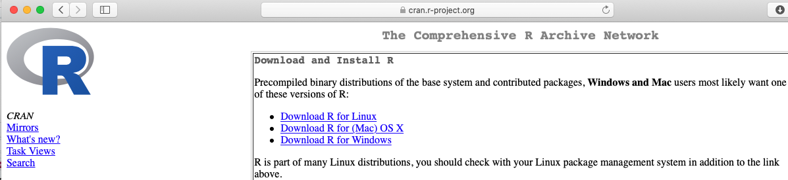
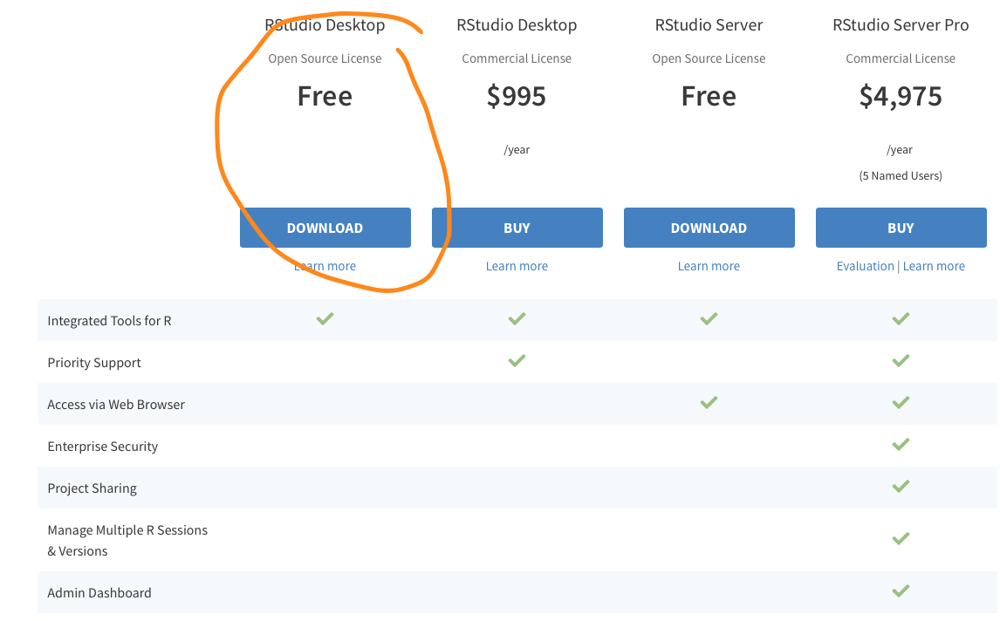
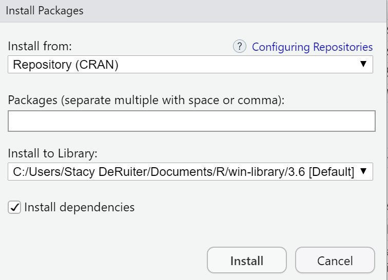

```{r setup, include=FALSE}
knitr::opts_chunk$set(echo = TRUE, eval = FALSE)
```

## Motivation

Calvin provides access to an [RStudio server](https://rstudio.calvin.edu:8787/auth-sign-in) to give students easy access to the statistical computing software needed for this course. All students need to do is log in, with nothing to install or maintain. 

**For most students, the server is the best way to use RStudio, and they have no reason to install a standalone copy of the software on a personal computer. If you are happy using the server, exit this tutorial now and continue happily using the server!**

If you have concerns about your internet bandwith, speed, usage limits, or firewalls, or if you want to be able to work on assignments for this class somewhere without internet access, you may feel more comfortable working in RStudio offline instead of on the server.

### Pros and Cons
The **benefits** of downloading your own copy are that **you can work offline** and should not be subject to server-related errors, freezing, etc.

The **negatives** of downloading your own copy are that you have to maintain it yourself, installing and updating packages and software. You will also **not be able to use shared RStudio projects with classmates** - You will have to find another way to collaborate on R code; I will support your using github if you are interested, or you can invent your own system to share files via cloud storage like OneDrive, Dropbox, Google, etc.

## Goal

**This document will guide you through the process of installing R, RStudio, and other necessary R packages on your own computer, if you choose to do so. There is no course requirement to do this.**

The process will have three stages, which work best in order:

1. Install R
2. Install RStudio
3. Install necessary R packages from within RStudio

## Download/Install 1 of 2: R

**R** downloads are available from <https://cran.r-project.org/>.

```{r, echo = FALSE, eval = TRUE, out.width = '85%'}

```

- Select the download that matches your operating system and hardware (Mac OS, Windows, Linux, etc.)
- You only need the "base" version. 
- Download the installer and run it. You may want to choose not to create shortcuts, since you will access R only through RStudio.


### Mac with Homebrew

**Windows and Linux users: skip this section.**

- If working on Mac OS and already using Homebrew to manage software packages, you can skip the manual download above and just run:

```{r, eval = FALSE}
brew install r
```

- If you want to get Homebrew and install this way **on a mac**, [there are detailed instructions online](https://www.r-bloggers.com/how-to-install-r-on-mac-ubuntu-and-windows/) -- scroll down to "Instructions for Mac Users". Note that you don't necessarily need OpenBLAS for this course (as recommended on the linked website); it does not really matter either way.

## Download/Install 2 of 2: RStudio

Once you have installed R, you next need to install **RStudio**.

- Downloads of RStudio are available at <https://rstudio.com/products/rstudio/download/>.
- You should select the **free version** of **RStudio Desktop.**
- Download and install the version that matches your operating system

```{r, echo = FALSE, eval = TRUE, out.width = '85%'}

```

### Mac with Homebrew

**Windows and Linux users: you can't use Homebrew.**

- If using a mac and Homebrew, you can alternatively install RStudio via:

```{r, eval = FALSE, echo = TRUE}
brew cask install rstudio
```

## Install 3/3: Packages
In addition to base R and the RStudio IDE, we use a few add-on packages that you will need to install yourself.

- Open RStudio
- In your RStudio **Console** window, which is on the lower left by default, type (or copy and paste) the code below and click "Enter" to run it:

```{r, echo = TRUE, eval = FALSE}
install.packages('rmarkdown') # reproducible research documents

install.packages(c('mosaic', 'tidyverse', 'remotes', # graphics and data wrangling
                   'faraway', 'fivethirtyeight', # datasets
                   'glmmTMB', 'mgcv', 'DHARMa', 'MuMIn', 'geepack', # model fitting
                   'ggeffects', 'broom', 'car', # working with fitted models
                   'shiny', 'plotly', 'gganimate',# interactive graphics
                   'leaflet', 'mapdeck')) # and maps

install.packages('fivethirtyeightdata', 
                 repos = 'https://fivethirtyeightdata.github.io/drat/', 
                 type = 'source') # more data
```

- In addition to the packages you listed specifically, a number of dependencies (other packages that the packages you requested require to work) will be installed. 
- The amount of time it takes will depend on your computer and internet connection speed, but as long as it finishes without any messages that say "Error: ...", it worked!.
- If RStudio prompts you to update packages or install additional dependencies, it's usually a good idea to do so.
- If you get an error or have any questions, get in touch with your professor.

### TeX for PDF generation
To enable generation of PDF output from Rmarkdown documents, there is a little more code to run. (If you don't know what this means yet, you will soon - and you *do* probably need to be able to do it.)

This one has two steps: installing the package, and then *using* the package to install the PDF-generation utility.

If you already have TeX/LaTeX/MikTeX installed on your computer, you can probably skip this installation (but it won't hurt).

```{r, echo = TRUE, eval = FALSE}
install.packages('tinytex')
tinytex::install_tinytex()  # install TinyTeX
```

### Additional package for STAT 245
Once all the package installation above is complete, then run:

```{r}
remotes::install_github('stacyderuiter/s245')
```

As before, messages will appear in the Console, and you need not worry as long as there are no errors.

### Point-and-Click Option

If you would like to install the packages interactively instead of on the command line, you can click the **Packages** tab on the lower right in RStudio, then click *Install* at the top of the tab. Enter the names of the packages you want to install in the middle "Packages" blank, and leave the rest of the default options, then click "Install".
  
```{r, echo = FALSE, eval = TRUE, out.width = '85%'}

```


## You did it!
If you complete all three steps above, you should have a working version of RStudio on your machine.  To use it, just open RStudio; it should look nearly identical to the RStudio Server version you have been using online. 

(You don't ever have to open or access R directly; RStudio does it all for you.)

In case of any errors or problems, contact me (sld33) anytime and I'll do my best to help (don't contact Calvin's help desk; they don't support this software).  